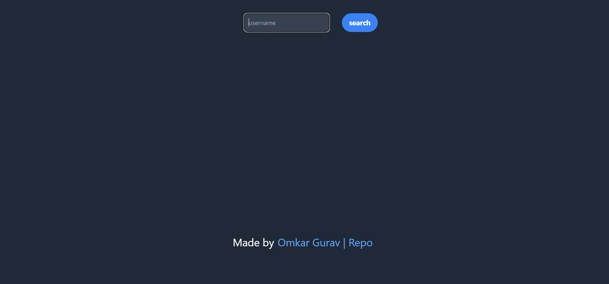
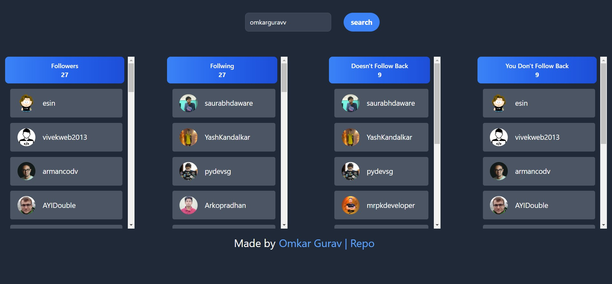

# Check your github followers Unfollowers!


[Check out the site here!](https://github-followers-unfollowers.netlify.app/)
---

  
  

---
<h2 align="center"> Contribution Guidelines 🏗 </h2>

We are excited to invite you to contribute to this project and make it better.

If you wish to contribute, we highly recommend following the guidelines mentioned below. 

**1.**  Fork [this](https://github.com/omkarguravv/github-follower-unfollower) repository.

**2.**  Clone your forked copy of the project.

```bash
   git clone https://github.com/omkarguravv/github-follower-unfollower.git
```

**3.** Navigate to the project directory.
```
   cd github-followers-unfollowers
```

**4.** Create a new branch:
```
   git checkout -b YourBranchName
```

Install dependencies

```bash
  npm install
```

Start the server

```bash
  npm run start
```

**5.** Make changes in source code.


**6.** Stage your changes and commit

```
   git add .
   git commit -m "<your_commit_message>"
```

**7.** Push your local commits to the remote repo.

```
   git push origin YourBranchName
```

**8.** Create a [PR](https://help.github.com/en/github/collaborating-with-issues-and-pull-requests/creating-a-pull-request)

**Note:** If anyone contributes to this repository, the changes will not be reflected in your local repository. For that:

**9.** Setup a reference(remote) to the original repository to get all the changes from the remote.
```
   git remote add upstream  https://github.com/omkarguravv/github-follower-unfollower.git
```

**10.** Check the remotes for this repository.
```
   git remote -v
```

**11.** Fetching from the remote repository will bring in its branches and their respective commits.
```
   git fetch upstream
```

**12.** Make sure that you're on your master branch.
```
   git checkout main
```

**13.** Now that you have fetched the upstream repository, you can merge its changes into our local branch. This will bring that branch into sync with the upstream, without losing the local changes.
```
   git merge upstream/main
```

---

**Contributors:**
<!-- <a href="https://github.com/omkarguravv/github-follower-unfollower">


  
</a> -->


<h1 align=center> OUR VALUABLE CONTRIBUTORS✨ </h1>
<p align="center">
  
	
<a href="https://github.com/omkarguravv/github-follower-unfollower">
  
</a>
</p>

---


 


